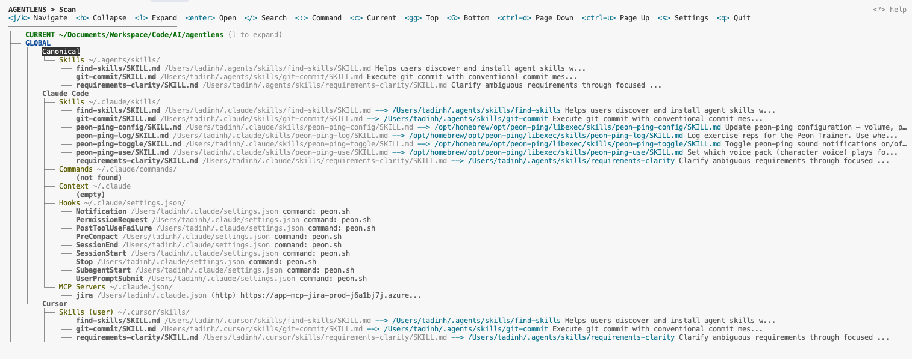
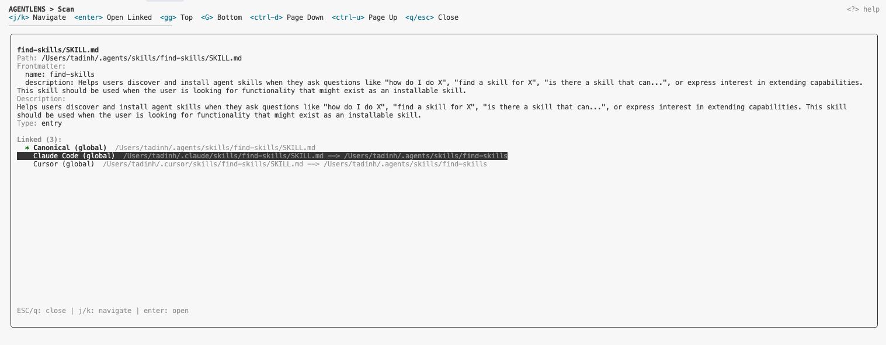
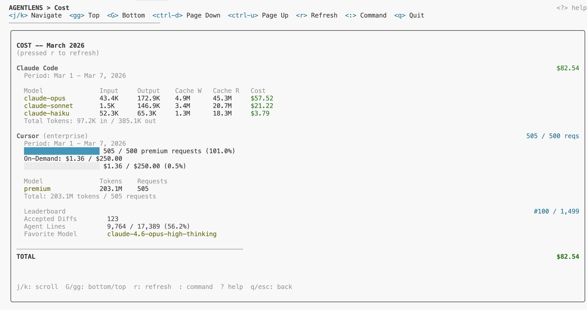
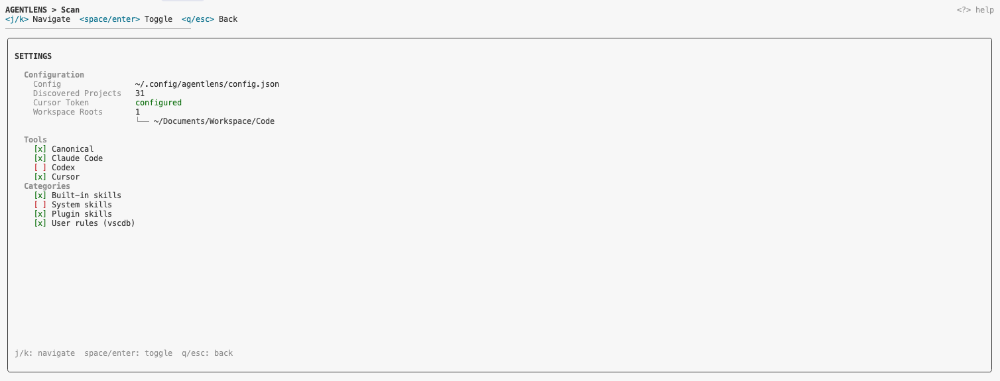

# AgentLens

[](https://www.npmjs.com/package/@tasszz2k/agentlens)
[](LICENSE)


CLI tool to scan agent configuration, track usage costs, and inspects agent configuration across AI coding tools.

AgentLens discovers skills, rules, commands, context files, hooks, and MCP server configs for **Cursor**, **Claude Code**, **Codex**, **GitHub Copilot**, and multi-agent setups (`AGENTS.md`). It scans both global (`~/.cursor`, `~/.claude`, etc.) and project-level locations, then displays an interactive tree or static text map. With configured workspace roots, it also discovers and scans all projects across your workspace.

It also provides a **cost dashboard** showing usage and costs for Claude Code (from local JSONL logs) and Cursor (from the Cursor API).

## Screenshots

### Scan -- agent configuration tree



### Skill detail panel



### Cost -- usage and cost dashboard



### Settings -- settings and configuration



## Sample Output

```
AGENTLENS -- Agent Configuration Map
=====================================

GLOBAL

  Canonical Store  ~/.agents/skills/
  ├── find-skills/SKILL.md "Helps users discover and install agent skills w..."
  ├── git-commit/SKILL.md "Execute git commit with conventional commit mes..."
  └── requirements-clarity/SKILL.md "Clarify ambiguous requirements through focused ..."
  Claude Code
  ├── Skills  ~/.claude/skills/
  │   ├── find-skills/SKILL.md --> ../../.agents/skills/find-skills "Helps users discover and install..."
  │   └── git-commit/SKILL.md --> ../../.agents/skills/git-commit "Execute git commit with conventi..."
  ├── Commands  ~/.claude/commands/
  │   └── (not found)
  ├── Context  ~/.claude
  │   └── (empty)
  ├── Hooks  ~/.claude/settings.json/
  │   ├── Notification command: notify.sh
  │   └── SessionStart command: notify.sh
  └── MCP Servers  ~/.claude.json/
      └── jira (http) https://jira.example.com/mcp
  Cursor
  ├── Skills (user)  ~/.cursor/skills/
  │   └── git-commit/SKILL.md --> ../../.agents/skills/git-commit "Execute git commit with conventi..."
  ├── Rules  ~/.cursor/rules/
  │   └── (not found)
  ├── Context (user rules)  ~/Library/Application Support/Cursor/User/globalStorage/state.vscdb
  │   └── (empty)
  ├── MCP Servers  ~/.cursor/mcp.json/
  │   ├── github-cloud (http) https://api.githubcopilot.com/mcp/ [auth]
  │   └── glean (http) https://example.glean.com/mcp/cortex
  └── Skills (plugin: cursor-public/glean)  ~/.cursor/plugins/cache/.../skills/
      ├── enterprise-search/SKILL.md "Search company documents, wikis, policies..."
      └── find-expert/SKILL.md "Find subject matter experts for a topic..."
  Codex
  ├── Skills  ~/.codex/skills/
  │   └── playwright/SKILL.md "Use when the task requires automating a real br..."
  ├── Rules  ~/.codex/rules/
  │   └── default.rules
  └── MCP Servers  ~/.codex/config.toml/
      └── (empty)

PROJECT  ~/Code/myapp

  Cursor
  └── Rules  ~/Code/myapp/.cursor/rules/
      └── project-context.mdc "Project context and conventions"

OTHER PROJECTS  (5 discovered)

  ~/Code/backend-api
  Claude Code
  ├── Skills  .claude/skills/
  │   ├── api-patterns/SKILL.md "REST API design patterns and conventions..."
  │   └── testing-guide/SKILL.md "Testing guidance for behavior changes..."
  └── Context
      └── CLAUDE.md
  Cursor
  ├── Rules  .cursor/rules/
  │   ├── agent-behavior.md
  │   ├── git-conventions.md
  │   └── go-conventions.md
  └── Skills  .cursor/skills/
      └── (empty)

  ~/Code/web-dashboard
  Canonical Store  .agents/skills/
  ├── frontend-design/SKILL.md "Create distinctive, production-grade frontend..."
  └── tailwind-design-system/SKILL.md "Build scalable design systems with Tailwind..."
  Cursor
  └── Rules  .cursor/rules/
      ├── coding-standards.mdc "Coding standards and conventions"
      └── project-context.mdc "Project overview and architecture..."
```

## Install

```bash
# From npm (recommended)
npm install -g @tasszz2k/agentlens

# Or run directly with npx
npx @tasszz2k/agentlens

# Or from source
git clone https://github.com/tasszz2k/agent-lens.git
cd agent-lens
npm install && npm run build
npm link
```

## Quick Start

### 1. Configure workspace roots

Tell AgentLens where your projects live so it can discover and scan them all:

```bash
# Add one or more root directories containing your projects
agentlens config --add-root ~/Code
agentlens config --add-root ~/Documents/Workspace

# Verify configured roots
agentlens config --list-roots
```

AgentLens will recursively discover projects with agent markers (`.cursor/`, `.claude/`, `CLAUDE.md`, `AGENTS.md`, `.github/copilot-instructions.md`) up to 3 levels deep.

### 2. Run AgentLens

```bash
# From any project directory -- scans global + current project + all discovered projects
agentlens
```

That's it. AgentLens launches an interactive TUI showing your full agent configuration map across all tools and projects.

### 3. Explore the tree

- Navigate with `j`/`k` (or arrow keys), expand/collapse with `l`/`h`
- Press `Enter` to view entry details (path, symlinks, frontmatter, linked installations)
- Press `/` to search/filter, `ESC` to clear
- Press `:` to open the command bar and switch pages (Scan, Cost)
- Press `?` to toggle the help bar

### 4. View usage costs

```bash
# Open the cost dashboard directly
agentlens cost

# Or switch to the Cost page from the TUI with `:cost`
```

See [Cost Dashboard](#cost-dashboard) for setup details.

## Usage

```
agentlens [scan] [options]      Scan and display agent config tree (default)
agentlens cost [options]        Show agent usage and cost dashboard
agentlens where [name]          Trace where canonical skills are installed
agentlens troubleshoot          Run health checks with optional AI analysis
agentlens config                Manage workspace roots, tokens, and tool filters
agentlens config tools          Manage tool/category visibility filters
```

### Options

**scan** (default command)

| Flag | Description |
|---|---|
| `-p, --project <path>` | Project directory to scan (default: cwd) |
| `--no-global` | Skip global config scanning |
| `--no-ai` | Skip AI analysis |
| `--json` | Output JSON instead of tree |

**cost**

| Flag | Description |
|---|---|
| `--json` | Output JSON instead of formatted text |
| `--no-cursor` | Skip Cursor API (only show Claude Code costs) |

**config**

| Flag | Description |
|---|---|
| `--add-root <path>` | Add a workspace root directory |
| `--remove-root <path>` | Remove a workspace root directory |
| `--list-roots` | List configured root directories |
| `--set-cursor-token <token>` | Set Cursor session token (auto-detected by default) |
| `--clear-cursor-token` | Remove stored Cursor session token |
| `--set-cursor-team-id <id>` | Override Cursor team ID for leaderboard (auto-detected by default) |
| `--clear-cursor-team-id` | Remove stored Cursor team ID |

### Examples

```bash
# Scan current project + global config (interactive TUI in TTY)
agentlens

# Scan a specific project, JSON output
agentlens scan -p ~/projects/myapp --json

# View cost dashboard
agentlens cost

# View Claude Code costs only (skip Cursor)
agentlens cost --no-cursor

# Find where a canonical skill is installed
agentlens where git-commit

# Run health checks
agentlens troubleshoot

# Filter tools -- hide Codex from results
agentlens config tools --disable "Codex"

# Filter categories -- hide plugin skills
agentlens config tools --disable "plugin"

# Show current filter state
agentlens config tools
```

## Cost Dashboard

AgentLens aggregates usage and cost data from multiple AI coding tools into a single view.

### Claude Code

Costs are calculated from local usage logs (`~/.claude/projects/*/` JSONL files). Token counts (input, output, cache read, cache write) are aggregated per model and multiplied by model-specific pricing to produce estimated costs for the current month.

No setup required -- AgentLens reads the logs directly from disk.

### Cursor

Usage data is fetched from the Cursor API. **No setup is required** -- AgentLens auto-detects the session token, email, and team ID from Cursor's local database and APIs.

The Cursor dashboard shows:

- **Plan type** and premium request usage against your plan limit (e.g., 505/500) with a progress bar
- **On-demand usage** showing individual spend against your limit (e.g., $1.20 / $250.00)
- **Per-model breakdown** of tokens and request counts
- **Leaderboard insights** (if on a team plan): your rank, accepted diffs, agent lines with acceptance ratio, and favorite model

If auto-detection fails (e.g., Cursor is not installed on this machine), you can manually provide a session token:

```bash
agentlens config --set-cursor-token <token>
```

To get the token: open [cursor.com](https://cursor.com) > DevTools (`F12`) > Application > Cookies > copy `WorkosCursorSessionToken`. The token is stored in `~/.config/agentlens/config.json`.

## What Gets Scanned

### Global (~)

| Tool | Category | Location |
|---|---|---|
| Canonical | Skills | `~/.agents/skills/` |
| Claude Code | Skills | `~/.claude/skills/` |
| Claude Code | Commands | `~/.claude/commands/` |
| Claude Code | Context | `~/.claude/CLAUDE.md` |
| Claude Code | Hooks | `~/.claude/settings.json` |
| Cursor | Skills | `~/.cursor/skills/`, `~/.cursor/skills-cursor/`, plugins |
| Cursor | Rules | `~/.cursor/rules/**/*.{mdc,md}` |
| Cursor | Context | User rules from Cursor settings DB |
| Codex | Skills | `~/.codex/skills/` |
| Codex | Rules | `~/.codex/rules/` |
| Cursor | MCP | `~/.cursor/mcp.json` |
| Claude Code | MCP | `~/.claude.json` |
| Codex | MCP | `~/.codex/config.toml` |

### Project

| Tool | Category | Location |
|---|---|---|
| Canonical | Skills | `.agents/skills/` |
| Claude Code | Skills | `.claude/skills/` |
| Claude Code | Commands | `.claude/commands/` |
| Claude Code | Context | `CLAUDE.md`, `.claude/CLAUDE.md` |
| Claude Code | Hooks | `.claude/settings.json`, `.claude/settings.local.json` |
| Cursor | Rules | `.cursorrules`, `.cursor/rules/**/*.{mdc,md}` (recursive) |
| Cursor | Skills | `.cursor/skills/` |
| Multi-agent | Context | `AGENTS.md` |
| Copilot | Context | `.github/copilot-instructions.md` |
| Claude Code | MCP | `.mcp.json` |
| Cursor | MCP | `.cursor/mcp.json` |
| Copilot | MCP | `.vscode/mcp.json` |

## Interactive TUI

When run in a TTY, AgentLens displays an interactive tree with vim-style navigation:

| Key | Action |
|---|---|
| `j` / `k` | Move down / up |
| `h` | Collapse node or jump to parent |
| `l` | Expand node |
| `Enter` | Open detail panel |
| `/` | Search / filter |
| `:` | Open command bar (switch pages) |
| `ESC` | Clear filter / close detail |
| `c` | Jump to CURRENT scope |
| `s` | Open settings (tool/category filter) |
| `gg` | Jump to top |
| `G` | Jump to bottom |
| `Ctrl+d` / `Ctrl+u` | Half page down / up |
| `?` | Toggle help bar |
| `q` | Quit |

### Pages

The TUI has two top-level pages, switchable via the `:` command bar (type or use up/down arrows to select):

- **Scan** -- agent configuration tree (default)
- **Cost** -- usage and cost dashboard

### Scopes

The Scan page tree is organized into three scopes:

- **CURRENT** (green) -- merged view of all active configs (global + project) for the current repo, grouped by category (Skills, Rules, MCP, etc.) then by tool. Collapsed by default; press `l` to expand.
- **GLOBAL** (blue) -- all global/user-level configurations organized by tool.
- **PROJECT** (white) -- project-level configurations for the current directory.

### Detail Panel

The detail panel shows entry metadata, symlink chains, frontmatter, and full descriptions. Linked entries (symlinks to the same file) and cross-references (same name, different file) are displayed separately and are navigable -- press `Enter` on a linked entry to jump directly to it.

### Settings

Press `s` to open the settings view where you can toggle visibility of individual tools (Canonical, Claude Code, Cursor, Codex, Copilot, Multi-agent) and categories (built-in skills, system skills, plugin skills, user rules). Changes are persisted to `~/.config/agentlens/config.json` and take effect immediately.

## Health Checks

The `troubleshoot` command detects:

- Broken symlinks in skill directories
- Skill installation gaps across tools
- Stale config files (>180 days untouched)
- Deprecated `.cursorrules` alongside `.cursor/rules/`
- Conflicting context files (`CLAUDE.md` + `AGENTS.md`)
- Permission issues

When Claude Code CLI is available, issues are forwarded for AI-powered analysis.

## Development

```bash
npm run dev         # Run via tsx (no build step)
npm run build       # Compile TypeScript to dist/
npm start           # Run compiled output
```

## Architecture

```
src/
  cli.ts            CLI entry, Commander setup (scan, cost, where, troubleshoot, config)
  scan.ts           Core scanning (global + project, multi-project discovery)
  parse.ts          Frontmatter, MDC, TOML, MCP JSON, hooks, SQLite parsing
  config.ts         Config, workspace roots, tool/category filters, Cursor token, project discovery
  cost.ts           Cost aggregation (Claude Code JSONL logs, Cursor API)
  render.ts         Static text output (CURRENT, GLOBAL, PROJECT with filtering, cost report)
  troubleshoot.ts   Health checks and diagnostics
  ai.ts             Claude Code CLI integration
  symlink.ts        Symlink detection and resolution
  types.ts          Shared type definitions
  ui/
    App.tsx          Interactive terminal UI (Ink/React), page navigation, CURRENT scope, filtering
    TreeView.tsx     Keyboard-navigable tree (vim keys, scroll persistence)
    SearchBar.tsx    '/' search filter
    CommandBar.tsx   ':' command palette for page switching
    DetailPanel.tsx  Entry detail view with linked entry navigation
    CostView.tsx     Usage and cost dashboard view
    SettingsView.tsx Tool/category filter settings panel
    HelpBar.tsx      Toggleable k9s-style keymap header
    theme.ts         Chalk theme (scope-colored headers)
```

## License

[MIT](LICENSE)
