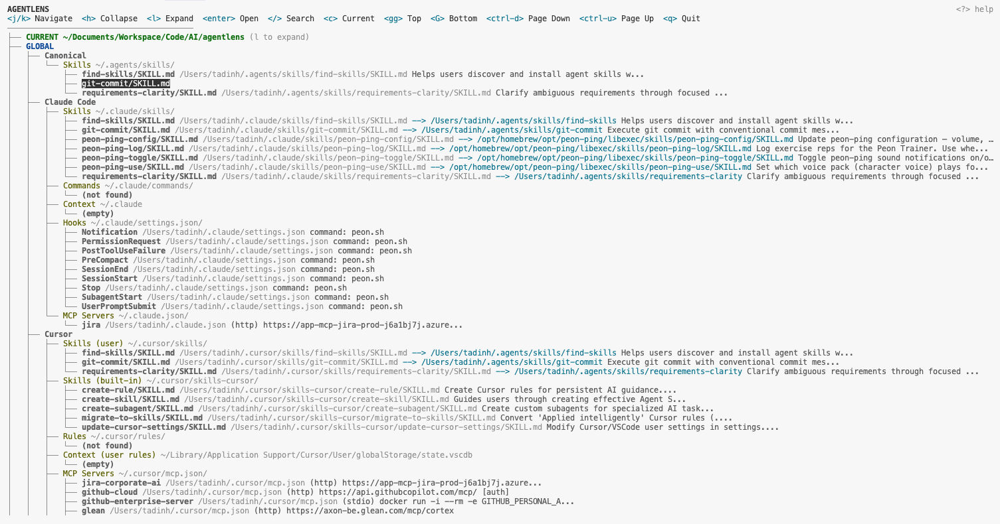

# AgentLens

CLI tool that scans and inspects agent configuration across AI coding tools.

AgentLens discovers skills, rules, commands, context files, hooks, and MCP server configs for **Cursor**, **Claude Code**, **Codex**, **GitHub Copilot**, and multi-agent setups (`AGENTS.md`). It scans both global (`~/.cursor`, `~/.claude`, etc.) and project-level locations, then displays an interactive tree or static text map. With configured workspace roots, it also discovers and scans all projects across your workspace.

## Sample Output

```
AGENTLENS -- Agent Configuration Map
=====================================

GLOBAL

  Canonical Store  ~/.agents/skills/
  ├── find-skills/SKILL.md "Helps users discover and install agent skills w..."
  ├── git-commit/SKILL.md "Execute git commit with conventional commit mes..."
  └── requirements-clarity/SKILL.md "Clarify ambiguous requirements through focused ..."
  Claude Code
  ├── Skills  ~/.claude/skills/
  │   ├── find-skills/SKILL.md --> ../../.agents/skills/find-skills "Helps users discover and install..."
  │   └── git-commit/SKILL.md --> ../../.agents/skills/git-commit "Execute git commit with conventi..."
  ├── Commands  ~/.claude/commands/
  │   └── (not found)
  ├── Context  ~/.claude
  │   └── (empty)
  ├── Hooks  ~/.claude/settings.json/
  │   ├── Notification command: notify.sh
  │   └── SessionStart command: notify.sh
  └── MCP Servers  ~/.claude.json/
      └── jira (http) https://jira.example.com/mcp
  Cursor
  ├── Skills (user)  ~/.cursor/skills/
  │   └── git-commit/SKILL.md --> ../../.agents/skills/git-commit "Execute git commit with conventi..."
  ├── Rules  ~/.cursor/rules/
  │   └── (not found)
  ├── Context (user rules)  ~/Library/Application Support/Cursor/User/globalStorage/state.vscdb
  │   └── (empty)
  ├── MCP Servers  ~/.cursor/mcp.json/
  │   ├── github-cloud (http) https://api.githubcopilot.com/mcp/ [auth]
  │   └── glean (http) https://example.glean.com/mcp/cortex
  └── Skills (plugin: cursor-public/glean)  ~/.cursor/plugins/cache/.../skills/
      ├── enterprise-search/SKILL.md "Search company documents, wikis, policies..."
      └── find-expert/SKILL.md "Find subject matter experts for a topic..."
  Codex
  ├── Skills  ~/.codex/skills/
  │   └── playwright/SKILL.md "Use when the task requires automating a real br..."
  ├── Rules  ~/.codex/rules/
  │   └── default.rules
  └── MCP Servers  ~/.codex/config.toml/
      └── (empty)

PROJECT  ~/Code/myapp

  Cursor
  └── Rules  ~/Code/myapp/.cursor/rules/
      └── project-context.mdc "Project context and conventions"

OTHER PROJECTS  (5 discovered)

  ~/Code/backend-api
  Claude Code
  ├── Skills  .claude/skills/
  │   ├── api-patterns/SKILL.md "REST API design patterns and conventions..."
  │   └── testing-guide/SKILL.md "Testing guidance for behavior changes..."
  └── Context
      └── CLAUDE.md
  Cursor
  ├── Rules  .cursor/rules/
  │   ├── agent-behavior.md
  │   ├── git-conventions.md
  │   └── go-conventions.md
  └── Skills  .cursor/skills/
      └── (empty)

  ~/Code/web-dashboard
  Canonical Store  .agents/skills/
  ├── frontend-design/SKILL.md "Create distinctive, production-grade frontend..."
  └── tailwind-design-system/SKILL.md "Build scalable design systems with Tailwind..."
  Cursor
  └── Rules  .cursor/rules/
      ├── coding-standards.mdc "Coding standards and conventions"
      └── project-context.mdc "Project overview and architecture..."
```

## Screenshot



## Install

```bash
npm install
npm run build
npm link        # optional, makes `agentlens` available globally
```

## Quick Start

### 1. Configure workspace roots

Tell AgentLens where your projects live so it can discover and scan them all:

```bash
# Add one or more root directories containing your projects
agentlens config --add-root ~/Code
agentlens config --add-root ~/Documents/Workspace

# Verify configured roots
agentlens config --list-roots
```

AgentLens will recursively discover projects with agent markers (`.cursor/`, `.claude/`, `CLAUDE.md`, `AGENTS.md`, `.github/copilot-instructions.md`) up to 3 levels deep.

### 2. Run AgentLens

```bash
# From any project directory -- scans global + current project + all discovered projects
agentlens
```

That's it. AgentLens launches an interactive TUI showing your full agent configuration map across all tools and projects.

### 3. Explore the tree

- Navigate with `j`/`k` (or arrow keys), expand/collapse with `l`/`h`
- Press `Enter` to view entry details (path, symlinks, frontmatter, linked installations)
- Press `/` to search/filter, `ESC` to clear
- Press `?` to toggle the help bar

## Usage

```
agentlens [scan] [options]      Scan and display agent config tree (default)
agentlens where [name]          Trace where canonical skills are installed
agentlens troubleshoot          Run health checks with optional AI analysis
agentlens config                Manage workspace roots for project discovery
```

### Options

| Flag | Description |
|---|---|
| `-p, --project <path>` | Project directory to scan (default: cwd) |
| `--no-global` | Skip global config scanning |
| `--no-ai` | Skip AI analysis |
| `--json` | Output JSON instead of tree |

### Examples

```bash
# Scan current project + global config (interactive TUI in TTY)
agentlens

# Scan a specific project, JSON output
agentlens scan -p ~/projects/myapp --json

# Find where a canonical skill is installed
agentlens where git-commit

# Run health checks
agentlens troubleshoot
```

## What Gets Scanned

### Global (~)

| Tool | Category | Location |
|---|---|---|
| Canonical | Skills | `~/.agents/skills/` |
| Claude Code | Skills | `~/.claude/skills/` |
| Claude Code | Commands | `~/.claude/commands/` |
| Claude Code | Context | `~/.claude/CLAUDE.md` |
| Claude Code | Hooks | `~/.claude/settings.json` |
| Cursor | Skills | `~/.cursor/skills/`, `~/.cursor/skills-cursor/`, plugins |
| Cursor | Rules | `~/.cursor/rules/**/*.{mdc,md}` |
| Cursor | Context | User rules from Cursor settings DB |
| Codex | Skills | `~/.codex/skills/` |
| Codex | Rules | `~/.codex/rules/` |
| Cursor | MCP | `~/.cursor/mcp.json` |
| Claude Code | MCP | `~/.claude.json` |
| Codex | MCP | `~/.codex/config.toml` |

### Project

| Tool | Category | Location |
|---|---|---|
| Canonical | Skills | `.agents/skills/` |
| Claude Code | Skills | `.claude/skills/` |
| Claude Code | Commands | `.claude/commands/` |
| Claude Code | Context | `CLAUDE.md`, `.claude/CLAUDE.md` |
| Claude Code | Hooks | `.claude/settings.json`, `.claude/settings.local.json` |
| Cursor | Rules | `.cursorrules`, `.cursor/rules/**/*.{mdc,md}` (recursive) |
| Cursor | Skills | `.cursor/skills/` |
| Multi-agent | Context | `AGENTS.md` |
| Copilot | Context | `.github/copilot-instructions.md` |
| Claude Code | MCP | `.mcp.json` |
| Cursor | MCP | `.cursor/mcp.json` |
| Copilot | MCP | `.vscode/mcp.json` |

## Interactive TUI

When run in a TTY, AgentLens displays an interactive tree with vim-style navigation:

| Key | Action |
|---|---|
| `j` / `k` | Move down / up |
| `h` | Collapse node or jump to parent |
| `l` | Expand node |
| `Enter` | Open detail panel |
| `/` | Search / filter |
| `ESC` | Clear filter / close detail |
| `gg` | Jump to top |
| `G` | Jump to bottom |
| `Ctrl+d` / `Ctrl+u` | Half page down / up |
| `?` | Toggle help bar |
| `q` | Quit |

The detail panel shows entry metadata, symlink chains, frontmatter, and cross-tool linking. Linked entries (symlinks to the same file) and cross-references (same name, different file) are displayed separately and are navigable -- press `Enter` on a linked entry to jump directly to it.

## Health Checks

The `troubleshoot` command detects:

- Broken symlinks in skill directories
- Skill installation gaps across tools
- Stale config files (>180 days untouched)
- Deprecated `.cursorrules` alongside `.cursor/rules/`
- Conflicting context files (`CLAUDE.md` + `AGENTS.md`)
- Permission issues

When Claude Code CLI is available, issues are forwarded for AI-powered analysis.

## Development

```bash
npm run dev         # Run via tsx (no build step)
npm run build       # Compile TypeScript to dist/
npm start           # Run compiled output
```

## Architecture

```
src/
  cli.ts            CLI entry, Commander setup
  scan.ts           Core scanning (global + project, multi-project discovery)
  parse.ts          Frontmatter, MDC, TOML, MCP JSON, hooks, SQLite parsing
  config.ts         Config + workspace root management + project discovery
  render.ts         Static text output
  troubleshoot.ts   Health checks and diagnostics
  ai.ts             Claude Code CLI integration
  symlink.ts        Symlink detection and resolution
  types.ts          Shared type definitions
  ui/
    App.tsx          Interactive terminal UI (Ink/React)
    TreeView.tsx     Keyboard-navigable tree (vim keys, scroll persistence)
    SearchBar.tsx    '/' search filter
    DetailPanel.tsx  Entry detail view with linked entry navigation
    HelpBar.tsx      Toggleable k9s-style keymap header
    theme.ts         Chalk theme
```

## License

MIT
